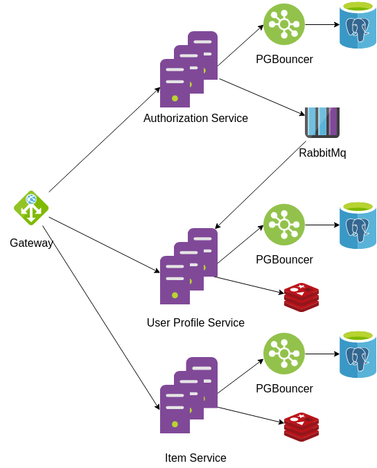

## App for advertising goods for sale

### Architecture of the application

### Microservices

#### Gateway 
The nginx server that maps requests for other service. In the high load system here should be balancer for several instances of one service.

#### Identity 
The service is responsible for users registration and generetating jwt for users.

##### Database schema

|Column name | type|
|------------|-----|
|id          | uid |
|name | varchar|
|createdAt | timestamp|
|passwordHash | text|

#### UserProfile
The service is responsible for managing (set users bio, view other profiles) users profiles.

##### Database schema
|Column name | type|
|------------|-----|
|id          | uid |
|name | varchar|
|createdAt | timestamp|
|bio | text|

#### ItemService 
The service is responsible for managing goods of each users.
Users can create their own goods, can view list items (with pagination) or view one item.

##### Database schema
|Column name | type|
|------------|-----|
|id          | int |
|name | varchar|
|userId | varchar|
|userName | varchar|
|createdAt | timestamp|
|description | text |
|cost | float |

#### RabbitMq
A service responsible for asynchronous communication between services. In this project, the message pool is needed to create a new entry in the userprofile database when a new user is registered in the identity service.

#### PostgreSQL 
The most polpular relative DB for storing structural data.

#### Redis
Used for storing cache for userprofiles service and items service.

### REST endpoints
|method | location | description |
|-------|----------|-------------|
| Identity service |
|POST | /api/auth/register/| users restration |
|POST | /api/auth/login/ | generate new jwt for access to other endpoints|
|UserProfile service |
|POST | /api/userprofile/set-bio/ | set bio of current user |
|GET | /api/userprofiles/{username}/ | get info about user by username|
|Items service |
|POST | /api/items/item/ | post new item | 
|GET | /api/items/ | get info about last loaded item |
|GET | /api/items/{id}/ | get info about item by item id |
|GET | /api/items/myitems/ | get items posted by current user |
|GET | /api/items/cursor/{id}/ | get ordered 20 items with last item with id equals cursor |

